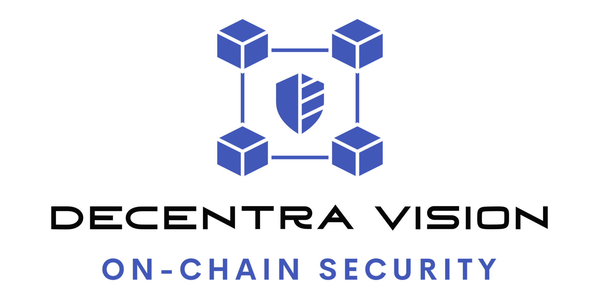

<picture><source srcset="./img/banner_dark.png" media="(prefers-color-scheme: dark)"/></picture>
### Represented by Mario Poneder  , also known as 0xTheC0der  .  
---

&nbsp;
&nbsp;
<a href="https://twitter.com/MarioPoneder"><picture><source srcset="./img/social/x_dark.png" media="(prefers-color-scheme: dark)"/></picture></a>&nbsp;
&nbsp;
&nbsp;
<a href="https://cantina.xyz/u/0xTheC0der"><picture><source srcset="./img/social/cantina_dark.png" media="(prefers-color-scheme: dark)"/></picture></a>&nbsp;
<a href="https://github.com/MarioPoneder"><picture><source srcset="./img/social/github_dark.png" media="(prefers-color-scheme: dark)"/></picture></a>

&nbsp;

## About 

An introduction about me and my company. 

### Decentralizing the future, block by block ...
Hi, I am Mario Poneder, a former software engineer who found his way into the Web3 space and gladly offer you my services as an **independent smart contract security researcher**.

You might already know me by my alias 0xTheC0der, since I am active on multiple decentralized audit platforms and participating in bug bounty programs.  

> ✅ **I pursue one clear target**  
> With my continuous contribution to the Web3 security landscape, I want to help innovators like you to build a decentralized future, block by block, and therefore drive adoption.

&nbsp;

### My professional journey began ...

… as a developer in the fields of industrial automation and [GPU-accelerated parallel computing](https://www.khronos.org/opencl/), after finishing a school focused on electronics and computer engineering.  
Later on, while getting my master’s degree in engineering physics, I was performing particle physics simulations for a [dark matter research project](https://cresst-experiment.org/).  
After graduating from university, I took the opportunity to work as the lead embedded software engineer for an emerging company which manufactures electrical drives for intralogistics applications.   
In parallel to this job, I kept pursuing my interest in blockchain technologies and eventually came to the realization, that there is an emerging demand for developers which are confident with the current state of this technology and are open for what is yet to come.   
This has led me to the firm decision to pivot my career and found **Decentra Vision** in the beginning of the year 2022.  

Since then, I have had a lot of amazing experiences such as exchanging knowledge with inspiring like-minded individuals, working on sophisticated codebases and spotting severe vulnerabilities.  
All of this has contributed to finding my true passion in reviewing smart contracts to make the Web3 space safer and therefore drive adoption, while enhancing my skillset as an **independent security researcher** along the journey.

---

&copy; 2024 Decentra Vision e.U. &ndash; All rights reserved

