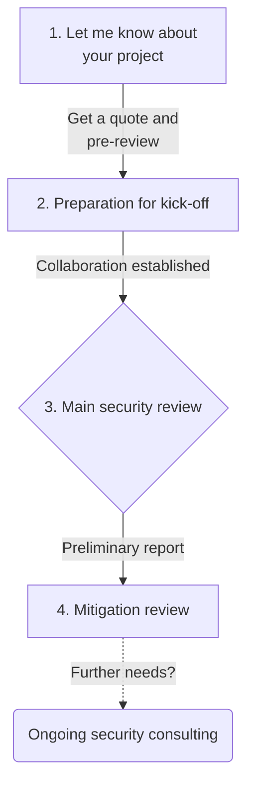

# Security review process
A brief overview about the security review process, what to expect and how you can benefit from it.

&nbsp;

## 1. Let me know about your project &ndash; [Get a quote](https://tally.so/r/3lOGb6){: .btn .btn-blue }

**Get in touch** with me using [this form](https://tally.so/r/3lOGb6) or one of the [communication channels](#communication-channels) below and please provide me with the following information about your project:

- [x] Link to the **source code repository** and definition of files, folders or contracts in **scope**.  
*In case of a private repository, please invite [@MarioPoneder](https://github.com/MarioPoneder) as a collaborator.*  
- [x] Relevant specifications, **documentation** and previous audit reports, if already available depending on the current stage of your project.  
- [x] Link to the parent project, in case this is a **fork**.  
- [x] Your **projected timeline**, i.e. do you need a security review now or in a few weeks/months?  
- [x] Further **questions** or information from your side.  

> ℹ️ **Important**  
> All non-public information shared with me will be treated as confidential.

&nbsp;

## 2. Preparation for kick-off &ndash; Determining our collaboration
Once you provided me with the required information, I will proceed to **pre-review** your codebase and get back to you for scheduling a call &ndash; could also be a chat if you prefer &ndash; in order to cover the following topics:
- [x] **First findings** walkthrough, in case I could already identify bugs/vulnerabilities during the pre-review.
- [x] Locking the **commit hash** for the main security review.
- [x] Breakdown of the **quote** and downpayment. See also [Price model &ndash; Severity matrix](/price-model.html).  
  *The quote is based on a severity-tiered per-finding price model. You are free to opt for a fixed hourly rate instead, if you prefer.*
- [x] Determining if our **collaboration is the right fit** for both sides.
- [x] Setting the **timeline** for the main security review.

> ℹ️ **Important**  
> All findings identified during the pre-review are free of charge, irrespective of you proceeding to collaborate with me or not.

&nbsp;

## 3. Main security review &ndash; Communication is key

Apart from being focused on the full security assessment of your codebase, the main security review involves the following aspects:
- [x] A kick-off call  &ndash; optional, but highly recommended &ndash; where you provide me with **in-depth insights** into your protocol and/or a walkthrough of select parts of the codebase.  
*This will give me a headstart into the security review which usually turns out to be beneficial when identifying vulnerabilities.*
- [x] Every time a relevant **finding** is uncovered, I will proceed to share it with you **immediately** via our dedicated communication channel &ndash; could also be a new issue in a private repository &ndash; including recommended **mitigation steps** and a runnable proof-of-concept, depending on the complexity of the finding.  
*This way, you can already work on issue mitigation in parallel to the security review.*
- [x] At the end of the main review, you will receive a **preliminary report** in Markdown format covering all the bugs/vulnerabilities which were identified to date.  
*There might also be multiple non-critical findings and recommendations which are better wrapped up in a dedicated call instead of being part of the report.*

> ⚠️ **Warning**  
> Despite the relentless striving to uncover all bugs/vulnerabilities within a given codebase, this process is mainly bound by time and expertise. Consequently, no security researcher including myself can guarantee 100% security and flawless future functionality after a review.  
> A security review is no substitute for an overall security strategy, but yet an important component of it.  

&nbsp;

## 4. Mitigation review &ndash; Finalization

Once the main review has concluded, it only takes the following steps to get the best out of the issue mitigation phase:
- [x] Please **comment** on each bug/vulnerability outlined in the preliminary report with a link to the commit that **resolves** it or acknowledge it as "won't fix".  
*Thereby, it is best practice to fix only one issue within one commit for clarity.*
- [x] Each of your **mitigation commits** will be **reviewed** concerning correctness and security.  
  *Note that new features, comprehensive refactoring or architectural changes are not part of the mitigation review.*
- [x] At the end of the mitigation review, you will receive a **finalized report** in Markdown format covering all previously uncovered bugs/vulnerabilities and their reviewed mitigation measures.  
  *The report will be delivered as a PDF file, if requested.*

> 📝 **Note**  
> Although I can understand your wish to keep the final report confidential, I'd highly appreciate your approval to publish it.

&nbsp;

## Extra: Ongoing security consulting &ndash; I've got your back
This service is independent from the security review and can be booked separately on demand.  
I am here to help you with your future security concerns, e.g.:
- [x] Deploying and initializing your protocol on-chain, i.e. **going live**.
- [x] Reviewing new contracts and other changes on **protocol upgrades**.  
   *Basically a light version of the above security review.*
- [x] Bug bounty report analysis and **mitigation consulting**.

